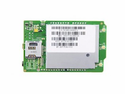

## DO IT YOURSELF!

# Moto Alarm Project (Linkit One version)

##### LOCATE YOUR MOTORCYCLE 24 HOURS A DAY AND 365 DAYS A YEAR

[Moto Alarm Project Website](https://motoalarm-project.com "Moto Alarm Project")

#### PROJECT FUNCTIONALITIES (For iOS or Android apps):

- You can see the position of your motorcycle at all times.
- You can see the last update date of your motorcycle's position.
- If your motorcycle is moving, speed in meters per second.
- You can activate and deactivate the service via bluetooth.
- You can see the battery status of the device.
- You can activate and deactivate the service through sms from the application.
- If your motorcycle starts to move, you will receive an alert by SMS of the change of position of the motorcycle and the speed.
- You can ask him to send you an SMS or chat to see the status of the battery.
- You can ask for the position of the motorcycle and you will receive an SMS.
- You can also ask how it is and it will send you temperature, humidity and whether it is raining or not ;)

#### PROJECT FUNCTIONALITIES (For macOS app):

- You can see the position of your motorcycle at all times.
- You can see the last update date of your motorcycle's position.
- If your motorcycle is moving, speed in meters per second.
- You can see the battery status of the device.

#### UPDATE TIMES (For iOS and Android apps):

- With the service deactivated, the status of the battery is sent every <b>24 hours</b>.
- With the service activated, all data is sent every <b>12 hours</b>, but if the motorcycle with MPU650 module detects movement, it is sent every <b>30 seconds</b>.
- From the mobile application, you can change the default update time and adapt it to your needs, but the MPU6050 sensor will activate the services if necessary and save battery ;)

### DOWNLOAD iOS VERSION:

[Moto Alarm Project iOS version](https://itunes.apple.com/us/app/moto-alarm-project/id1313229312?l=es&ls=1&mt=8 "Moto Alarm Project iOS version")


### DOWNLOAD macOS VERSION:

I'm developing this version :)

### DOWNLOAD ANDROID VERSION:

I'm developing this version :)

### WHAT IS ARDUINO?

Arduino is an open-source electronics platform based on easy-to-use hardware and software. It's intended for anyone making interactive projects.

This is the manufacturer's website:

[Arduino Website](https://www.arduino.cc "Arduino")

To program for Arduino, you need to download the Integrated development environment (IDE):

[Arduino Sofware Website](https://www.arduino.cc/en/Main/Software "Arduino Software")

### LINKIT ONE BOARD

For this project, I found an Arduino board that integrated all the modules I needed and had a good price: Linkit One.

The LinkIt ONE development board is an open source, high-performance board for prototyping Wearables and IoT devices. It's based on the world's leading SoC for Wearables, MediaTek Aster (MT2502) combined with high-performance Wi-Fi (MT5931) and GPS (MT3332) chipsets to provide you with access to all the features of MediaTek LinkIt. It also provides similar pin-out features to Arduino boards, making it easy for you to connect to various sensors, peripherals, and Arduino shields.





This is the manufacturer's website:

[SeedStudio Website](https://www.seeedstudio.com "SeedStudio")

In order to use this board with the Arduino IDE, you need to follow some steps:

[Linkit One Guide Website](https://docs.labs.mediatek.com/resource/linkit-one/en "SeedStudio")

### MPU6050

MPU6050 sensor module is an integrated 6-axis Motion tracking device.

It has a 3-axis Gyroscope, 3-axis Accelerometer, Digital Motion Processor and a Temperature sensor, all in a single IC.

It can accept inputs from other sensors like 3-axis magnetometer or pressure sensor using its Auxiliary I2C bus.

If external 3-axis magnetometer is connected, it can provide complete 9-axis Motion Fusion output.

A microcontroller can communicate with this module using I2C communication protocol. Various parameters can be found by reading values from addresses of certain registers using I2C communication.

Gyroscope and accelerometer reading along X, Y and Z axes are available in 2’s complement form. Temperature reading is also available in signed integer form.

Gyroscope readings are in degrees per second (dps) unit; Accelerometer readings are in g unit; and Temperature reading is in degrees Celsius.

This module is used to send movement alert by SMS and not consume battery sending data if they are not necessary to the server.

<b>Connection to Linkit One:</b>

[Tutorial for connection MPU6050 to Linkit One](http://www.instructables.com/id/Interfacing-MPU6050-with-Linkit-One/ "MPU6050 in Linkit One")


[MPU6050 in 'Amazon' shop](https://www.amazon.es/SODIAL-MPU-6050-giroscopio-Acelerometro-Arduino/dp/B00K67X810/ref=sr_1_4?ie=UTF8&qid=1525460814&sr=8-4&keywords=mpu6050 "MPU6050")

### INSTRUCTIONS

You have to add a SIM card in your Linkit One with the PIN code deactivated in order to use the GPRS connection, in addition, I use a card with SMS to be able to communicate with the motorcycle, as well as over the Internet, by normal SMS.

I use FreedomPop SIM, it is free with:

- 200 mb for data
- 300 SMS
- 100 minutes for call

[FreedomPop Website](https://es.freedompop.com/es?experience=organic.default "FreedomPop")

Once you have everything configured in the Arduino IDE to use your new Linkit One board, you can already clone this repository on your computer and access the MotoAlarmProject folder and open the <b>MotoAlarmProject.ino</b> file.

You need to download and install two libraries that are used in the project in the Arduino IDE:

[ArduinoJson in GitHub](https://github.com/bblanchon/ArduinoJson "ArduinoJson")

[elapsedMillis in GitHub](https://github.com/pfeerick/elapsedMillis "elapsedMillis")

[MPU6050 in GitHub](https://github.com/jarzebski/Arduino-MPU6050 "MPU6050")

The only class in which you need to add your data is in the <b>PublicConstants.h</b> class.


Your configuration data is in this class, but you only need to add the following:

- The name of the device to connect by bluetooth with the iOS application. If you do not modify it in the application or in the device code, it will be 'MotoAlarmProject'.

```
// Device name
static char deviceNameForBluetooth[] = "MotoAlarmProject";
```

- To configure internet access from your Linkit One with your SIM card, you must add your operator's configuration. In my case, the APN property is orangeworld and the username and password are empty.

```
// APN
static char apnName[] = "apnName";
static char apnUser[] = "";
static char apnPassword[] = "";
```

- To receive SMS from your Linkit One, add your phone number in userPhone property.
- Once you download the app for iOS (iPhone and iPad) and register as a user, you must put your registration email and your password in the userMail and userPassword properties respectively, so that your Linkit One can get a session token and do requests sending the data to the server. Also, look at your user id in the application profile and put it in the userId property.

```
// User
static char* userPhone = "+34600000000";
static String userMail = "\"mail@mail.com\"";
static String userPassword = "\"userPassword\"";
static String userId = "userId";
```

- You can also translate the texts for the SMS sent by your motorcycle to the language of your choice.

```
// Text for SMS and request POST
static String textForStatusSMS = "My coordinates on map: ";
static String textForStatusErrorSMS = "Sorry, my coordinates on map contain errors...";
static String textForBatterySMS = "Right now, I have this battery percentage: ";
static String textForFeelSMS = "I'm fine. Thank you very much! :)";
static String textForResetSMS = "Wait, I'm restarting now...";
static String textForResetSMSDisabled = "Sorry, this functionality is not in use yet...";
static String textForActivateSMS = "Perfect! My location is active :)";
static String textForDesactivateSMS = "Oops... Now my location is disabled :(";
static String textForWetSMS = "I'm very wet... ";
static String textForColdSMS = "I'm very cold... ";
static String textForHotSMS = "I'm very hot... ";
static String textForAlarmSMS = "Hey! I'm moving! Speed: ";
```

You can now upload the code to your Linkit One!

### BOX FOR LINKIT ONE AND BATTERY WITH 6000mAh (Battery size: 19x54x54mm)

If you have a 3D printer or know someone who has it, here are the .stl files to print that I designed for the project:


[STL files in Thingeverse.com by me](https://www.thingiverse.com/thing:2859090 "STL files")

### BATTERY WITH 6000mAh


[Battery in 'BricoGeek' shop](http://tienda.bricogeek.com/baterias-lipo/418-bateria-lipo-6000mah-37v.html)

### INSTALLING IN YOUR MOTORBIKE

I have changed the original battery with 1000mAh for a battery with 6000mAh, so it lasts a lot longer without charging.

I added a usb charger to the battery in my motorcycle but in positive, that means that when I turn off the motorcycle it has no current, it only charges the powerbank when the motorcycle is on.

### BATTERY BAG FOR SECURITY (OPTIONAL)

If you do not like the batteries like me, you can use a bag of fire protection for batteries.


[Battery bag in 'Aliexpress' shop](https://es.aliexpress.com/store/product/Lipo-Safe-Bag-Battery-Charging-Protector-Fireproof-Fiber-Pouch-Bag-Explosion-proof-Case-Storage-Box-for/2409111_32782212024.html)

### DO YOU CAN'T THE DEVICE? ASK FOR MY HELP!

Don't worry, write me to my email and I can build it for you at the price of materials and shipping :)

### LEGAL CONDITIONS

General regulation of data protection and terms of use:

- This application needs a user registration through his email and a password.

- All the data that can be requested in the user's profile, such as: name, surname, address, telephone, etc., are optional and therefore, are not needed for the normal use of the application.

- This application is used to, by means of a device that the user constructs and places on his motorcycle, to locate it at any time by sending his location to his user account.

- The last coordinates of the motorcycle are stored in the server and no history of them is saved.

- The user has at his disposal a button in the settings of the application to delete his account and all the data associated with it.

- This application does not use analytics and does not transfer user data to third parties, nor does it exploit usage data for its benefit.

- The developer of this project is not responsible under any circumstances, that the position of the vehicle is not registered correctly.

### LICENSE

This project is free and use CC BY-SA.


This license lets others remix, tweak, and build upon your work even for commercial purposes, as long as they credit you and license their new creations under the identical terms. This license is often compared to “copyleft” free and open source software licenses. All new works based on yours will carry the same license, so any derivatives will also allow commercial use. This is the license used by Wikipedia, and is recommended for materials that would benefit from incorporating content from Wikipedia and similarly licensed projects.

[View License Deed](https://creativecommons.org/licenses/by-nd/4.0) | [View Legal Code](https://creativecommons.org/licenses/by-nd/4.0/legalcode)

### THANK YOU

Nothing else, if you want to improve the Linkit One code, do not hesitate to share it with me. For any question you have, you can write me to my email in the iOS application.

Thank you very much! I hope you like it!


##### ArtCC 2017++
